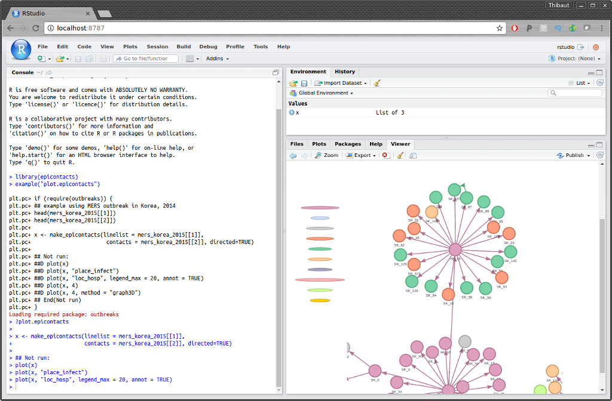
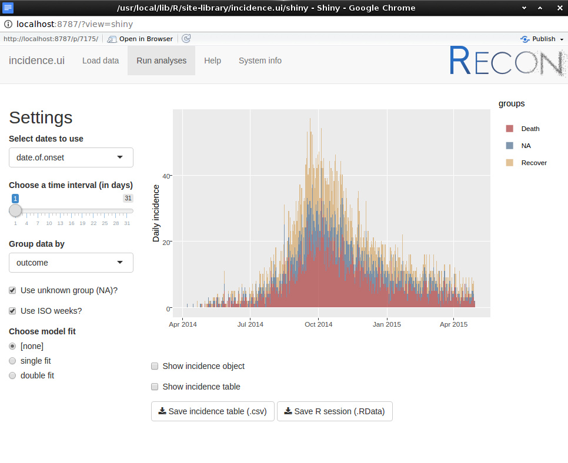

RECON docker images
===================

What is this?
-------------

[Docker](https://www.docker.com/what-docker) provides a robust, lightweight way
to ship applications within a small, self-sufficient operating system, which
includes all the dependencies and tools required for the app the run
smoothly. This structure is called a *container*, and different versions of a
container are referred to as *images*.


The major advantage of using this system to deploy a set of applications is that
applications are guaranteed to work the same for every user, regardless of their
operating system or system settings. For RECON packages, this means that you do
not need to worry about using the right R version, or installing packages and
their dependencies, because the RECON docker image will contain all this
already.


Several RECON docker images will be developed. The default one will always be
`reconhub/recon`.


How can I use it?
-----------------

### Installing docker

First of all, you need docker installed on your computer. Follow [this
link](https://www.docker.com/community-edition#/download) for guidelines to
install Docker Community Edition.

Then you need to choose the RECON docker image you want to use (see next
sections on available images), and choose how you want to use the image. There
are **two recommended ways** to use RECON docker images: starting a **Rstudio
server**, or starting a **bash session**.


### Rstudio server 

This approach is aimed at regular users, is the use the image to start a Rstudio
server, which enable the user to start a Rstudio session within a web browser,
with all currently functional RECON packages and their dependencies
pre-installed. In short: you will be able to use the RECON packages without even
installing R or Rstudio. See an example of such session using the package
[*epicontacts*](http://www.repidemicsconsortium.org/epicontacts/):



Importantly, you can also start the RECON GUI from this session. For instance,
to start the incidence GUI, you only need typing `incidence.ui::incidence_ui()`:




This image is started by typing:
```
docker run -d -p 8787:8787 reconhub/recon
```

where `reconhub/recon` can be replaced by your preferred RECON docker image. A
Rstudio session can then be started by opening a web browser and going to the
URL `127.0.0.1:8787` (or `localhost:8787`). The login and password are
'rstudio'.


### `bash` session

This approach is recommended for developers. It will open a `bash` shell logged
as `guest` within the `/home/guest`. A folder `/home/guest/dev` will contain git
clones of the various installed packages. A R session can be started (without
support for graphics) simply by typing `R`.

To start the docker image with a `bash` shell, type:
```
docker run --rm -it --user guest reconhub/recon /bin/bash
```

where `[image]` is the docker image you want to use. 


Available docker images
-----------------------

A list of available images can be found from the [RECON docker repository](https://hub.docker.com/u/reconhub/dashboard/).


### Default image: `reconhub/recon`

#### Description

This image contains all functional RECON packages. CRAN versions are installed
when available, otherwise github versions are used. It also contains package
sources for testing. It is based on
[rocker/verse](https://hub.docker.com/r/rocker/tidyverse/)


#### Content summary

- CRAN packages: *outbreaks*, *incidence*, *epicontacts*

- github packages: *epicontacts*, *distcrete*, *outbreaker2*, *vimes*,
*shinyHelpers*, *recon.ui*, *incidence.ui*, *epicontacts.ui*

- users: 'guest' (for bash session) and 'rstudio' (for Rstudio session) 

- package sources: git-cloned in `/home/guest/dev/`


### Devel image: `reconhub/devel`

#### Description

This image designed for testing is based on daily snapshots of R-devel from
[rocker/drd](https://hub.docker.com/r/rocker/drd). It also
contains all the sources of the packages cloned from github.


**Note**: unless you need to test a package on R-devel, prefer using the more
  reliable default image (reconhub/recon).


#### Content summary

- github packages: *outbreaks*, *incidence*, *epicontacts*, *distcrete*,
*outbreaker2*, *vimes*, *shinyHelpers*, *recon.ui*, *incidence.ui*,
*epicontacts.ui*

- users: 'guest' (for bash session)

- package sources: git-cloned in `/home/guest/dev/`


Contributions
-------------

Contributors (by alphabetic order):
- [Thibaut Jombart](https://github.com/thibautjombart)

See details of contributions on:
<br>
https://github.com/reconhub/docker/graphs/contributors


Contributions are welcome via **pull requests**.

Please note that this project is released with a [Contributor Code of
Conduct](CONDUCT.md). By participating in this project you agree to abide by its
terms.

**Maintainer:** Thibaut Jombart (thibautjombart@gmail.com)
